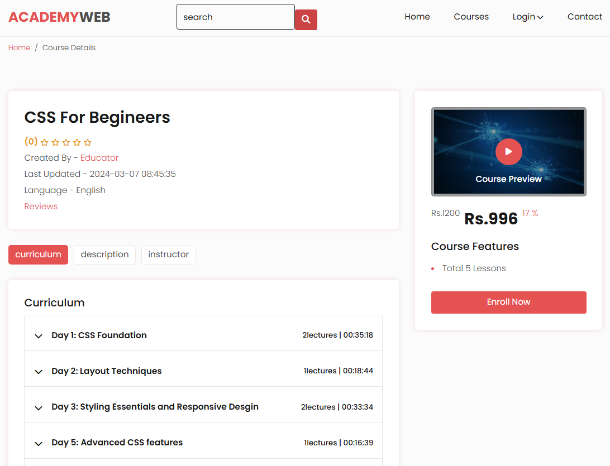
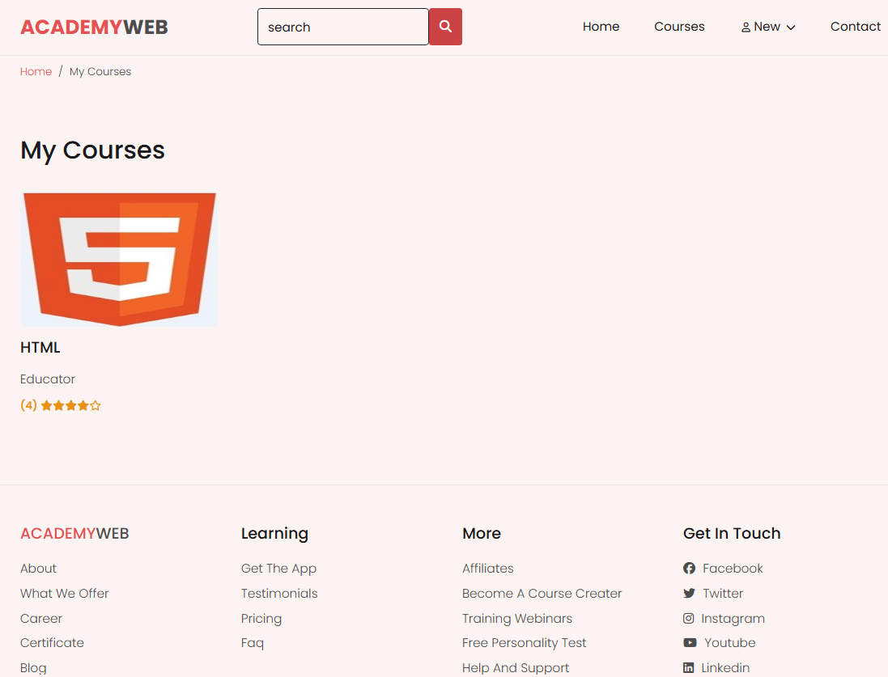
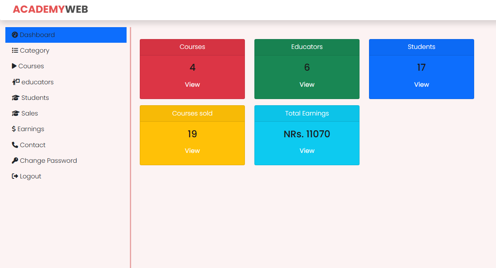
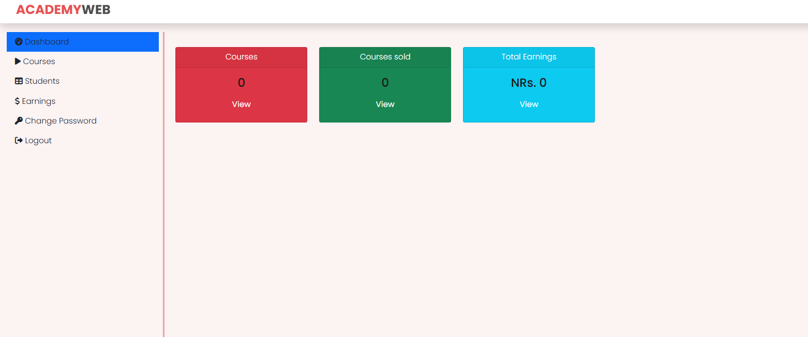
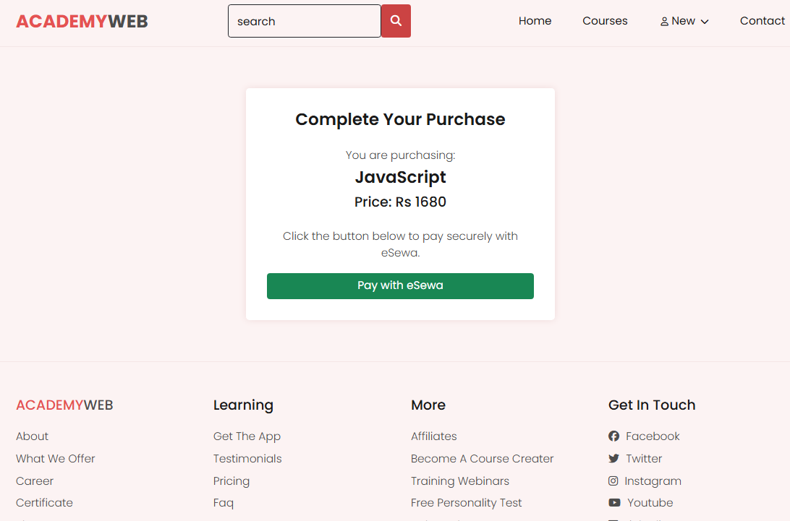

# 🎓 AcademyWeb — Online Learning Platform

A clean **PHP/MySQL e-learning platform** with dedicated dashboards for **Admins**, **Educators**, and **Students**.  
Create, manage, sell, and take courses — with built-in reviews and **eSewa payments**.

---

## ✨ Key Features
- **Admin**: Manage courses, categories, users, and view sales reports  
- **Educator**: Create courses, upload lessons/videos/PDFs, track enrollments & earnings  
- **Student**: Browse/search, enroll, pay with eSewa, watch content, leave reviews  

---

## 🛠 Tech Stack
- **Backend:** PHP, MySQL, Apache (WAMP/XAMPP)  
- **Frontend:** HTML, CSS, JavaScript, Bootstrap  
- **Tools:** Composer  
- **Libraries:**  eSewa Payment Gateway API  

---

## 📦 Prerequisites
Make sure you have installed:
- WAMP or XAMPP  
- Composer  
- A browser (Chrome/Firefox)  
- A code editor (VS Code)  

---

## 🚀 Quick Start (Local Setup)

### 1. Place Project
Copy the project folder to your server root:
- WAMP: `C:\wamp64\www\`  
- XAMPP: `C:\xampp\htdocs\`

### 2. Database Setup
1. Start **Apache** and **MySQL** from WAMP/XAMPP  
2. Open [http://localhost/phpmyadmin](http://localhost/phpmyadmin)  
3. Create a database named `course`  
4. Import `course.sql` from the project folder  

### 3. Install Dependencies
Open terminal in the project folder and run:
```bash
composer install
```
### 4. Run the App
Visit: http://localhost/academyweb/


---

## 👤 Default Logins (Demo Accounts)

| Role       | URL                                    | Username/Email     | Password  |
|------------|----------------------------------------|--------------------|-----------|
| **Admin**  | `http://localhost/academyweb/admin/`   | admin              | admin     |
| **Educator** | `http://localhost/academyweb/educator/` | educator@gmail.com | educator  |
| **Student**  | `http://localhost/academyweb/log-in.php` | nabraj@gmail.com   | nabraj    |

---

## 📸 Screenshots
## 📸 Screenshots

<p align="center">
  
</p>

<p align="center">
  
</p>

<p align="center">
  
</p>

<p align="center">
  
</p>

<p align="center">
  
</p>

<p align="center">
  
</p>

<p align="center">
  
</p>

---  


